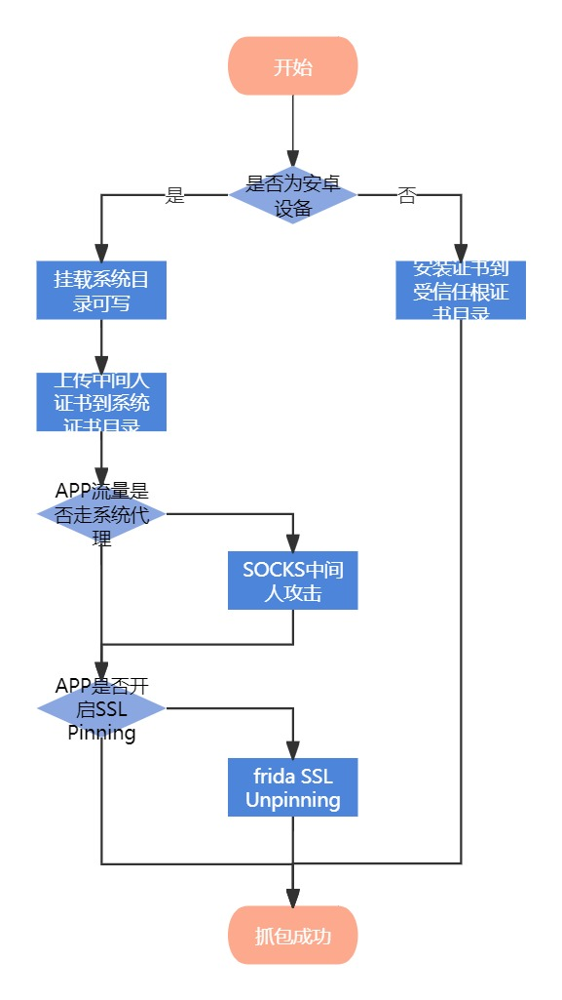

# Application-Penetration-Testing
Some Common Application Penetration Testing Methods and Approaches

一些常见的应用渗透测试方法和思路

## Android APP渗透 - 篡改技术

### 应用层数据包篡改



#### 将/system目录挂载为可写

##### 手动操作

- 获取 ROOT 权限

```powershell
adb root
```

- 禁用 Android 设备上的验证机制

```powershell
adb disable-verity
```

- 重启设备

```powershell
adb reboot
```

- 再次获取 ROOT 权限

```powershell
adb root
```

- 挂载/system为可写

```powershell
adb remount
adb shell mount -o rw,remount /system
```

##### 快捷脚本

[remount.bat](https://github.com/vpxuser/awesome-script/blob/main/remount.bat)

- 使用方法

```powershell
.\remount.bat [设备ID] [等待参数]
```

#### 上传中间人证书到安卓系统证书目录

##### 手动操作

- 获取证书哈希值

```powershell
openssl x509 -inform def -subject_hash_old -in cacert.der
```

- 将证书重命名为其哈希值.0

```powershell
copy cacert.der [证书哈希值].0
```

- 上传重命名后的证书到安卓系统证书目录

```powershell
adb push [证书哈希值].0 /system/etc/security/cacerts/
```

- 为证书赋予权限

```
adb shell chmod +x /system/etc/security/cacerts/[证书哈希值].0
```

##### 快捷脚本

[push.bat](https://github.com/vpxuser/awesome-script/blob/main/push.bat)

- 使用方法

```powershell
.\push.bat [证书文件路径] [设备ID]
```

#### 强制抓取所有TCP流量

##### 思考

- 问题1：你是否会遇到这种问题，APP没有使用SSL Pinning，但就是抓不到包？
- 原因：HTTP和HTTPS不走系统代理。
- 问题2：如何抓取不走系统代理的包？
- 答案：熟悉Proxifier的朋友都知道，Proxifier是一个真全局代理工具，他能让所有TCP协议都走SOCKS5代理；然后，HTTP、HTTPS是TCP的上层协议，所以，通过Proxifier就能强制抓取不走系统代理的HTTP和HTTPS，这种技术我称它为SOCKS5中间人攻击。
- 问题3：是否有现成的工具实现SOCKS5中间人攻击？
- 答案：有，比如说：Yakit、Charles等；但，作者并不推荐使用。
- 问题4：为什么不推荐使用上述SOCKS5中间人攻击工具？
- 原因：Yakit在作者实际测试过程中，发现并不能较好的解决多域名公用一个IP的情况，并且UI太过复杂，使用体验并不太好；Charles同样UI界面不友好，并且缺少强大的插件生态。
- 问题5：那么有什么较好的解决方案？
- 答案：使用作者开发的socks2https工具，能实现将SOCKS5转换为http或https，只需要将下游代理配置为Burp Suite或被动扫描器，就能实现SOCKS5中间人攻击。

##### 解决方案

[socks2https](https://github.com/vpxuser/socks2https)

- 查看README.md编译好二进制文件
- 填写好config.yml文件，配置好下游代理，即可实现SOCKS5中间人攻击
- 经作者测试，目前能支持联动Burp Suite、Xray，实际上能联动任意的代理工具，更多用法等待你挖掘

#### 绕过SSL证书绑定

[SSLUnpinning.js](https://github.com/vpxuser/awesome-script/blob/main/SSLUnpinning.js)

- 使用frida脚本绕过SSL证书绑定，使用的APP新人中间人证书，实现HTTPS协议抓包

```powershell
frida -U -f [APP ID] -l SSLUnpinning.js --no-pause
```

### 本地内存篡改

